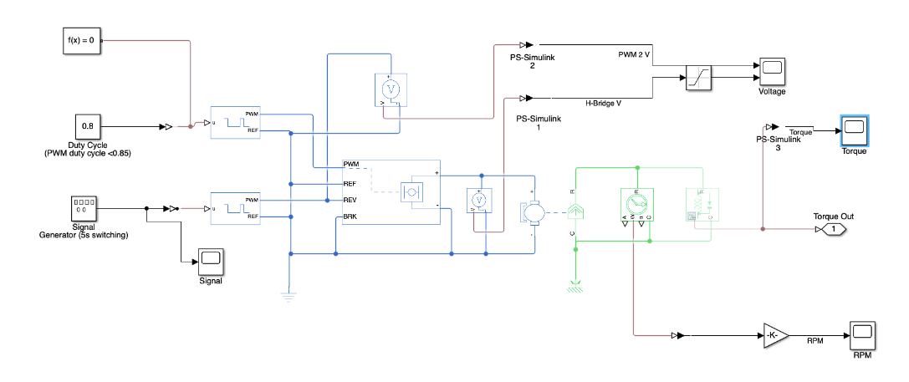
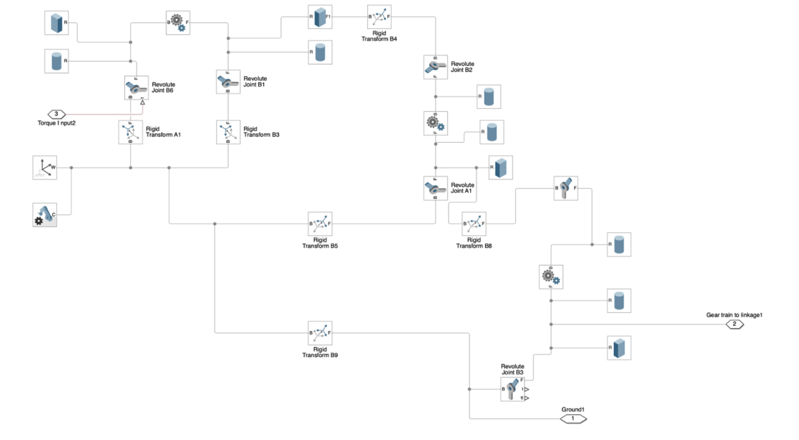
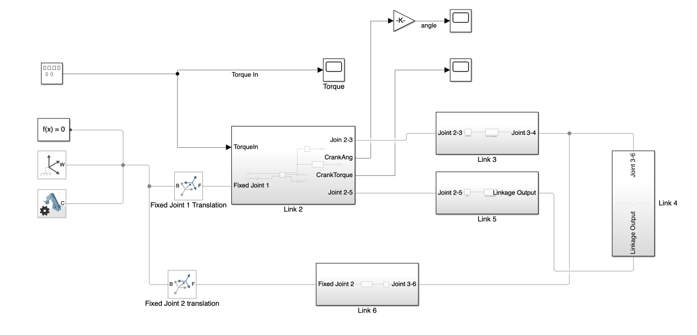
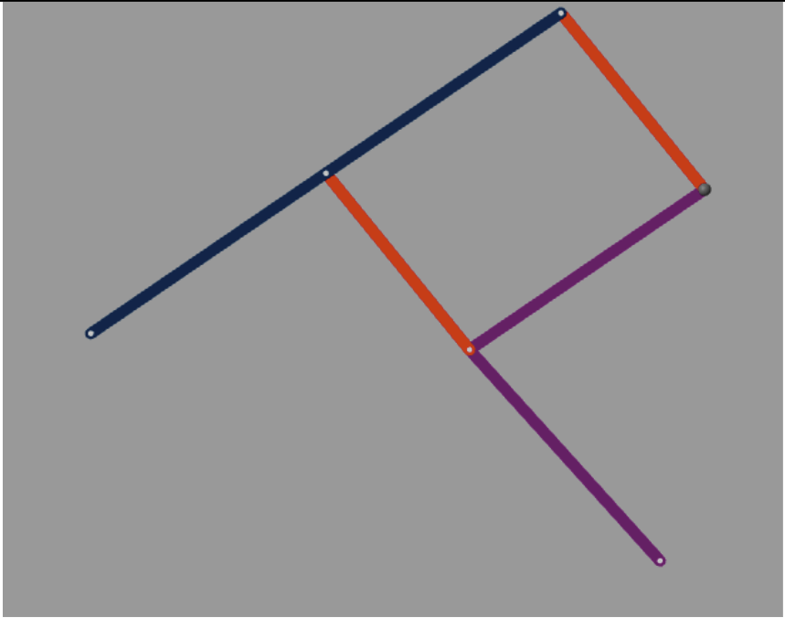
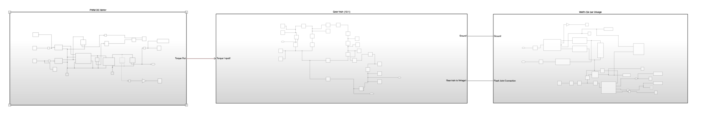
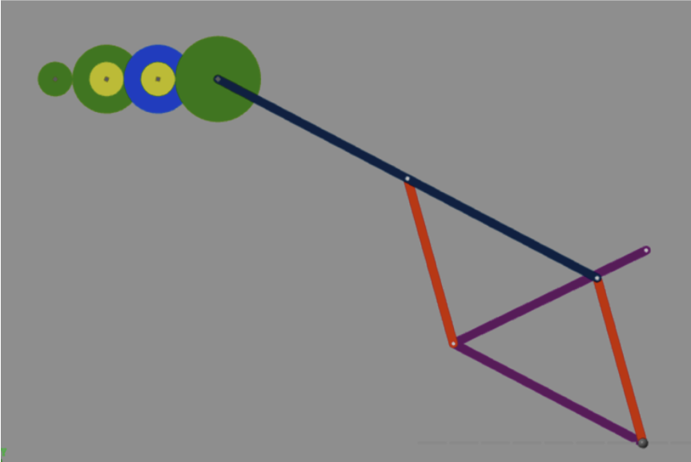

# Simulink Mechatronics System

MATLAB/Simulink implementation of mechatronics system with DC motor, gear train, and six-bar/Watt linkage simulation and analysis which is commonly used in Automotive Suspensions.

## Repository contents

### Modules

Each main module was tested and verified independently before integration into the final system model. Modules also contain submodules to keep the design organised

#### Motor

`motor.slx` implements the DC motor and H-bridge subsystem.

#### Gear train

`Geartrain.slx` implements the 10:1 gear train model.

#### Six-bar (Watt) linkage

`six_bar_linkage.slx` implements the six-bar linkage model.

#### Integrated system

`Design_Project.slx` integrates the motor, gear train, and linkage modules.

The project `report.pdf` details the design choices and supporting theory.

### Requirements

- MATLAB with Simulink (models include files saved for R2022a compatibility).
- Simscape and the relevant Simscape mechanical/electrical add-ons, if prompted when opening a model.
